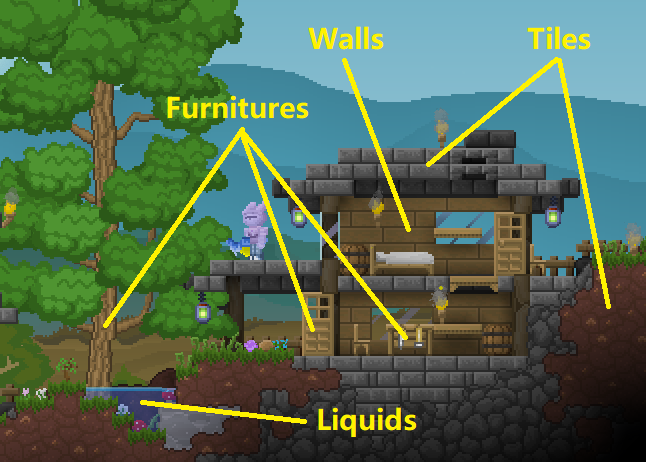

# 地图API

## 地图元素（Map Elements）

在阅读本篇API时，您需要了解TerraCraft中地图元素的基本概念。

### 方块（Blocks）

方块是最常见的地图元素，包括如下三种类型的方块。

* **图块（Tiles）**是由一个格子组成的前景方块。
* **背景墙（Walls）**是一个格子组成的后景方块，一般用于装饰。
* **家具（Furnitures）**是占用一个整体矩形区域的前景方块，占用一个或多个格子。一般用于处理大量功能拓展。

**前景**方块指的是**图块和家具**，**后景**方块指的是**背景墙**。

### 流体（Liquids）

流体是一种模拟现实液体的可流动地图元素，游戏会采用实时计算让流体得以平衡。一个地图格子中流体可以与家具和背景墙共存，但是不能与前景图块共存。

## 区块有效性（Chunk Validity）

TerraCraft中的地图采用动态区块加载技术实现无限地图。一个区块为1024x1024格。如果地图格子所在的区块存在，则这个地图格子有效。

在使用地图API时，请使用`IsValid`或`IsAreaValid`函数来保证所操作格子是有效的。对无效格子进行任何操作都是**没有意义**的行为。

## 地图通用模块（MapUtils）

### 通用常量

| 常量 | 类型 | 值 | 描述 |
| :--- | :---: | :---: | :--- |
| MapUtils._UNDERGROUND\_LINE_ | int | 416 | 地表层与地下层分界格纵坐标。 |
| MapUtils._NETHER\_LINE_ | int | 2450 | 地下层与地狱层分界格纵坐标。 |
| MapUtils._NETHER\_CAVE\_LINE_ | int | 2560 | 地狱层大型洞穴分界格纵坐标。 |

### 通用函数

#### 查询地图相关函数

这些函数在客户端和服务端均有效。

<table>
  <thead>
    <tr>
      <th style="text-align:left">&#x51FD;&#x6570;</th>
      <th style="text-align:center">&#x8FD4;&#x56DE;&#x503C;</th>
      <th style="text-align:left">&#x63CF;&#x8FF0;</th>
    </tr>
  </thead>
  <tbody>
    <tr>
      <td style="text-align:left">MapUtils.IsValid(int xi, int yi)</td>
      <td style="text-align:center">bool</td>
      <td style="text-align:left">&#x5224;&#x65AD;&#x6307;&#x5B9A;&#x683C;&#x5B50;&#x662F;&#x5426;&#x6709;&#x6548;&#xFF0C;&#x5373;&#x6240;&#x5728;&#x533A;&#x5757;&#x662F;&#x5426;&#x5B58;&#x5728;&#x3002;</td>
    </tr>
    <tr>
      <td style="text-align:left">MapUtils.IsAreaValid(int xi, int yi, int width, int height)</td>
      <td style="text-align:center">bool</td>
      <td style="text-align:left">&#x5224;&#x65AD;&#x77E9;&#x5F62;&#x533A;&#x57DF;&#x5185;&#x6240;&#x6709;&#x683C;&#x5B50;&#x662F;&#x5426;&#x90FD;&#x6709;&#x6548;&#xFF0C;&#x5373;&#x77E9;&#x5F62;&#x533A;&#x57DF;&#x8986;&#x76D6;&#x7684;&#x533A;&#x5757;&#x662F;&#x5426;&#x5168;&#x90E8;&#x5B58;&#x5728;&#x3002;</td>
    </tr>
    <tr>
      <td style="text-align:left">MapUtils.IsSolid(int xi, int yi)</td>
      <td style="text-align:center">bool</td>
      <td style="text-align:left">&#x5224;&#x65AD;&#x6307;&#x5B9A;&#x683C;&#x5B50;&#x662F;&#x5426;&#x4E3A;<b>&#x5B9E;&#x5FC3;&#x524D;&#x666F;</b>&#x3002;
         <em>&#x683C;&#x5B50;&#x65E0;&#x6548;&#x65F6;&#x603B;&#x662F;&#x8FD4;&#x56DE;false&#x3002;</em>
      </td>
    </tr>
    <tr>
      <td style="text-align:left">MapUtils.HasFront(int xi, int yi)</td>
      <td style="text-align:center">bool</td>
      <td style="text-align:left">
        
&#x5224;&#x65AD;&#x6307;&#x5B9A;&#x683C;&#x5B50;&#x662F;&#x5426;&#x6709;<b>&#x524D;&#x666F;&#x65B9;&#x5757;</b>&#x3002;

        
<em>&#x683C;&#x5B50;&#x65E0;&#x6548;&#x65F6;&#x603B;&#x662F;&#x8FD4;&#x56DE;false&#x3002;</em>
        

      </td>
    </tr>
    <tr>
      <td style="text-align:left">MapUtils.GetFrontID(int xi, int yi)</td>
      <td style="text-align:center">int</td>
      <td style="text-align:left">&#x83B7;&#x53D6;&#x6307;&#x5B9A;&#x683C;&#x5B50;&#x7684;<b>&#x524D;&#x666F;&#x65B9;&#x5757;ID</b>&#x3002;
         <em>&#x82E5;&#x4E0D;&#x5B58;&#x5728;&#x6216;&#x683C;&#x5B50;&#x65E0;&#x6548;&#x603B;&#x662F;&#x8FD4;&#x56DE;0&#x3002;</em>
      </td>
    </tr>
    <tr>
      <td style="text-align:left">MapUtils.GetFrontIDTag(int xi, int yi)</td>
      <td style="text-align:center">int, int</td>
      <td style="text-align:left">&#x83B7;&#x53D6;&#x6307;&#x5B9A;&#x683C;&#x5B50;&#x7684;<b>&#x524D;&#x666F;&#x65B9;&#x5757;ID&#x548C;&#x9644;&#x52A0;&#x503C;</b>&#x3002;
         <em>&#x82E5;&#x4E0D;&#x5B58;&#x5728;&#x6216;&#x683C;&#x5B50;&#x65E0;&#x6548;&#x603B;&#x662F;&#x8FD4;&#x56DE;&#x4E24;&#x4E2A;0&#x3002;</em>
      </td>
    </tr>
    <tr>
      <td style="text-align:left">MapUtils.HasWall(int xi, int yi)</td>
      <td style="text-align:center">bool</td>
      <td style="text-align:left">
        
&#x5224;&#x65AD;&#x6307;&#x5B9A;&#x683C;&#x5B50;&#x662F;&#x5426;&#x6709;<b>&#x80CC;&#x666F;&#x5899;</b>&#x3002;

        
<em>&#x683C;&#x5B50;&#x65E0;&#x6548;&#x65F6;&#x603B;&#x662F;&#x8FD4;&#x56DE;false&#x3002;</em>
        

      </td>
    </tr>
    <tr>
      <td style="text-align:left">MapUtils.GetWallID(int xi, int yi)</td>
      <td style="text-align:center">int</td>
      <td style="text-align:left">&#x83B7;&#x53D6;&#x6307;&#x5B9A;&#x683C;&#x5B50;&#x7684;<b>&#x80CC;&#x666F;&#x5899;&#x65B9;&#x5757;ID</b>&#x3002;
         <em>&#x82E5;&#x4E0D;&#x5B58;&#x5728;&#x6216;&#x683C;&#x5B50;&#x65E0;&#x6548;&#x603B;&#x662F;&#x8FD4;&#x56DE;0&#x3002;</em>
      </td>
    </tr>
    <tr>
      <td style="text-align:left">MapUtils.HasLiquid(int xi, int yi)</td>
      <td style="text-align:center">bool</td>
      <td style="text-align:left">
        
&#x5224;&#x65AD;&#x6307;&#x5B9A;&#x683C;&#x5B50;&#x662F;&#x5426;&#x6709;<b>&#x6D41;&#x4F53;</b>&#x3002;

        
<em>&#x683C;&#x5B50;&#x65E0;&#x6548;&#x65F6;&#x603B;&#x662F;&#x8FD4;&#x56DE;false&#x3002;</em>
        

      </td>
    </tr>
    <tr>
      <td style="text-align:left">MapUtils.GetLiquidID(int xi, int yi)</td>
      <td style="text-align:center">int</td>
      <td style="text-align:left">&#x83B7;&#x53D6;&#x6307;&#x5B9A;&#x683C;&#x5B50;&#x7684;<b>&#x6D41;&#x4F53;ID</b>&#x3002;
         <em>&#x82E5;&#x4E0D;&#x5B58;&#x5728;&#x6216;&#x683C;&#x5B50;&#x65E0;&#x6548;&#x603B;&#x662F;&#x8FD4;&#x56DE;0&#x3002;</em>
      </td>
    </tr>
  </tbody>
</table>

#### 修改地图相关函数

这些函数只在服务端执行，操作成功均返回true。

**在客户端中或者格子无效时不进行任何操作并总是返回false。游戏会通过内部算法自动将服务端的地图变化同步到客户端。**

| 函数 | 返回值 | 描述 |
| :--- | :---: | :--- |
| MapUtils.RemoveFront\(int xi, int yi\) | bool | **移除**指定格子的**前景方块**。 _若不存在前景或格子无效总是返回false。_ |
| MapUtils.RemoveWall\(int xi, int yi\) | bool | **移除**指定格子的**背景墙方块**。 _若不存在背景墙或格子无效总是返回false。_ |
| MapUtils.SetFrontTile\(int xi, int yi, int blockID, int tag = 0\) | bool | 在指定位置写入一个前景方块。 |
| MapUtils.SetFurniture\(int xi, int yi, int blockID, int tag = 0\) | bool |  |
| MapUtils.SetFront\(int xi, int yi, int blockID, int tag = 0\) | bool |  |

#### 

#### 不安全的函数（Unsafe Functions）

已弃用。

