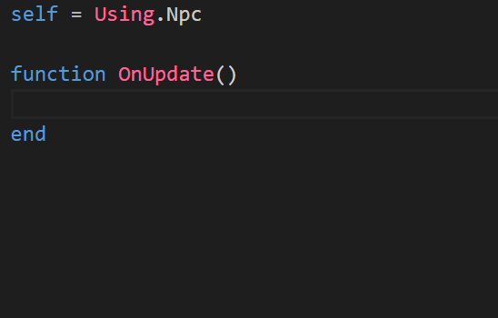
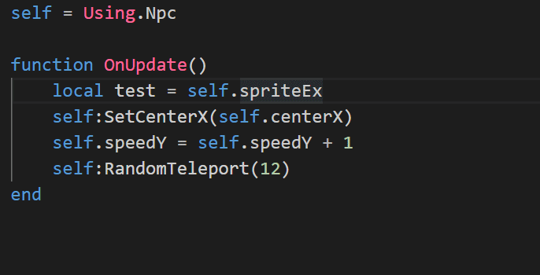

# 1.3 配置模组环境

## 创建模组文件夹

将游戏主目录的`empty_mod`文件夹完整地复制粘贴到游戏主目录的`devmods`文件夹内，作为将要开发Mod的模组文件夹，并将文件夹名称重命名为模组名称。

> _注：本教程以“ExampleMod”为例子，将文件夹重命名为ExampleMod，请按自己想要开发的模组名称给文件夹命名。_

## 使用VS Code打开模组文件夹

在VS Code中点击菜单项的**File-&gt;Open Folder...**，打开刚刚创建的模组文件夹。


## 配置模组基本信息

在tcmod.json文件中编写模组的基本信息。

```sql
{
  "modid": "exmod",
  "displayName": "ExampleMod",
  "description": "A journey ends and a new story begins.",
  "version": "1.0.0.0",
  "tcVersion": "Indev 1.1",
  "authorList": [ "BlueYoshi", "KfcMario" ],
  "credits": "Anything you want to thank.",
  "useSaver": true
}
```

**详细描述见：**[**模组配置表**](../datatable/tcmod.md)\*\*\*\*

### 知识点：模组命名空间

模组命名空间（`modid`，又称作`namespace`）是当前模组在整个模组包的唯一标识符。如果在所有加载的模组中出现了两个或多个命名空间相同的模组，这两个模组会发生冲突导致模组包加载失败。因此在命名`modid`时请尽可能选择一个不容易发生冲突的模组命名空间。TerraCraft原版的命名空间为`tc`或者`空`。

模组命名空间的重要作用是确保所有的对象（比如方块、物品、NPC、抛射物、特效等）的名称在全局空间中是独一无二的，每个对象在全局空间的唯一名称是`命名空间:名称`。通过如下简单的例子来理解：

> 假设当前加载了命名空间为happy\_days和coco\_world的两个模组，两个模组都有一个叫做dirt的方块，那么在全局空间中：  
> （1）dirt和tc:dirt均表示TerraCraft原版的泥土方块  
> （2）happy\_days:dirt表示happy\_days模组的泥土方块  
> （3）coco\_world:dirt表示coco\_world模组的泥土方块

对于TerraCraft原版的所有对象，它们在全局空间的唯一名称是`名称`或者`tc:名称`，请注意区别。

### 知识点：处理中文乱码问题

请将所有JSON文件保存为`UTF8`格式，否则在游戏运行过程中可能会出现乱码问题。

正确配置模组的界面如图，注意右下角必须使用`UTF8`格式对JSON文件编码。


## 检测模组是否配置成功

直接运行**TerraCraft.exe**，在菜单界面中点击“模组”按钮，若看到自己的模组在模组列表内，表示你的模组加载成功！


## 配置API

当游戏本体更新时，您需要将最新的`empty_mod/apis`文件夹覆盖到您的模组项目的`apis`文件夹中。apis文件夹用于给**EmmyLua**插件提供自动补全的功能。



您可以直接将鼠标置于字段上方，快速查看该字段的描述信息。


您可以**按住Ctrl键并单击指定字段**，可以查看对应API文件。在每个API文件最上方可以跳转到对应的文档页面。




